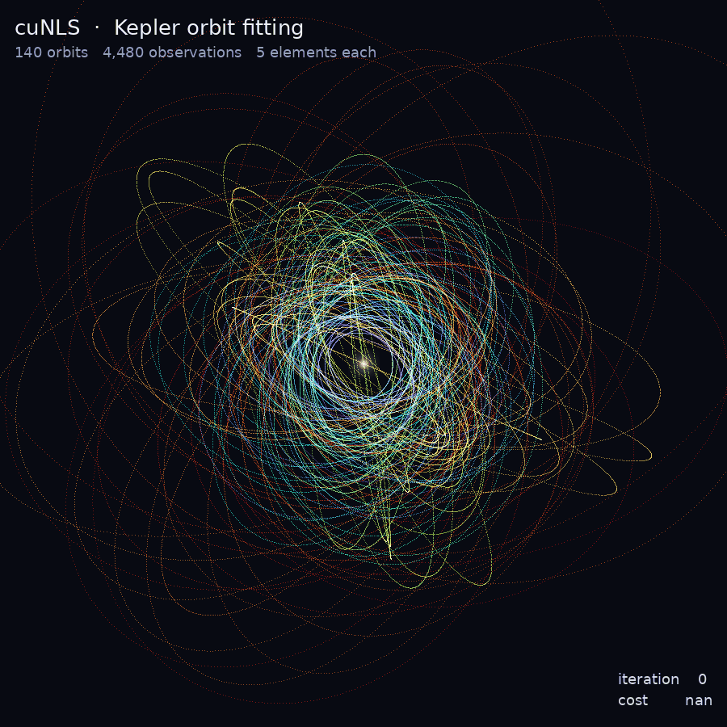

<p align="center">
  
</p>

<h3 align="center">GPU-Accelerated Nonlinear Least-Squares Solver</h3>

<p align="center">
  <code>CUDA/C++</code>&ensp;·&ensp;<code>Gauss-Newton</code>&ensp;·&ensp;<code>RANSAC</code>&ensp;·&ensp;<code>Factor Graph</code>&ensp;·&ensp;<code>Manifold Optimization</code>&ensp;·&ensp;<code>Sparse Linear Algebra</code>
</p>

---

**cuNLS** is a CUDA/C++ library for solving nonlinear least-squares problems on the GPU.
It is built around batched factor evaluation, sparse Jacobian assembly, and sparse linear
solvers — designed for large-scale geometric estimation workloads such as bundle adjustment,
pose graph optimization, and ICP-style alignment. For problems where many measurements are
gross outliers (wrong matches), its GPU **RANSAC minimizers** solve the same problems robustly
and return the inlier set.

cuNLS solves optimization problems of the form:

$$x^* = \arg\min_x \sum_i \rho_i\!\left(\left\|f_i(x)\right\|^2_{\Sigma_i}\right)$$

where $x$ is the optimization variable (often on a manifold), $f_i(x)$ are residual functions,
$\rho_i(\cdot)$ are optional robust loss functions, and
$\left\|v\right\|^2_{\Sigma} = v^T \Sigma^{-1} v$ is the Mahalanobis norm.

## Gallery

cuNLS refining two large estimation problems, one Gauss-Newton/LM iteration per frame:

<p align="center">
  
  &ensp;
  
</p>

- **Left — Sphere pose-graph refinement.** 200k points that should lie on a sphere
  are connected by relative ("between") constraints and start as a disturbed blob.
  cuNLS drives them back onto the sphere; color encodes per-point error, cooling from
  hot to calm as the solve converges.
- **Right — Kepler orbit fitting.** A family of orbits is observed as noisy 3-D points;
  cuNLS estimates the five Keplerian elements per orbit (custom NVIDIA Warp factor on an
  $\mathbb{R}^5$ state) and a jittered tangle of loops organizes into a crisp nested
  rosette of tilted ellipses.

## Features

| Category | Details |
|---|---|
| **Manifold support** | SO(2), SO(3), SE(2), SE(3), Sim(2), Sim(3), SL(4), Euclidean vectors |
| **Solvers** | Gauss-Newton, Levenberg-Marquardt with adaptive damping |
| **Robust estimation (RANSAC)** | `RansacGaussNewtonMinimizer`, `RansacLevenbergMarquardtMinimizer`: hundreds of hypotheses solved in parallel on the GPU from minimal samples, MSAC scoring, adaptive stopping, refinement on the inliers, per-factor inlier mask. Works with any factor and state type (built-in or custom) whose total free dimension is ≤ 64; any number of factors. Deterministic for a fixed seed; see [RANSAC](docs/sphinx/ransac.rst) |
| **Robust losses** | Huber, Cauchy, Arctan, SoftL1, Tolerant, Tukey, Scaled |
| **Built-in factors** | Reprojection, PnP, between (SO(2)/SO(3)/SE(2)/SE(3)/Sim(2)/Sim(3)/SL(4)/vector), point-to-point, point-to-plane, symmetric point-to-plane, prior, constant-velocity/constant-acceleration motion priors (SO(2)/SO(3)/SE(2)/SE(3)) |
| **Custom factors and states** | User-defined CUDA kernels via `SizedFactorBatch` / `SizedStateBatch` in C++, or CuPy / NVIDIA Warp kernels in Python; the same types work with every minimizer, including RANSAC — see [Custom factors and states](docs/sphinx/custom_factors_and_states.rst) |
| **Numeric Jacobians** | Finite-difference Jacobians for any factor batch (manifold-aware, reuses each state's `Plus` retraction), selectable globally (`MinimizerOptions::jacobian_mode`) or per factor group (`Problem::AddFactorBatch`'s override) — write a factor with only a residual and let cuNLS differentiate it; see [Numeric Jacobians](docs/sphinx/numeric_jacobians.rst) |
| **Linear solver** | Block-sparse PCG (variable block-Jacobi preconditioner, default), NVIDIA cuDSS (optional, loaded via `dlopen()` at runtime — see [Installation](docs/sphinx/installation.rst)), dense LDLT, dense Cholesky (cuSOLVER), dense QR (cuSOLVER) |
| **Safety checks** | Optional runtime validation (linear-solver diagnostics and more) — disable via `MinimizerOptions::disable_safety_checks` for low-latency solves |
| **Execution model** | Fully asynchronous via CUDA streams |

## Prerequisites

- NVIDIA GPU with compatible driver
- CUDA Toolkit (`nvcc`, `cudart`, `cuBLAS`, `cuSPARSE`, `cuSOLVER`)
- CMake >= 3.22
- C++17 compiler
- GNU Make

## Installation

### Build locally

```bash
./scripts/build_cunls.sh <build_dir> <Release|Coverage> [install_dir]
```

Example — release build with install:

```bash
./scripts/build_cunls.sh build Release /tmp/cunls_install
```

### Build with Docker

1. Install the [NVIDIA Container Toolkit](https://docs.nvidia.com/datacenter/cloud-native/container-toolkit/latest/install-guide.html).
2. Run:

```bash
./scripts/build_cunls_in_docker.sh <Release|Coverage> [local_install_dir]
```

The Docker build produces **both** shared and static variants. Intermediate
build directories live inside the container and are discarded; only the final
install directory is mounted to the host.

Install artifacts (default `build_docker/`, or the specified directory):

```
<install_dir>/
  include/cunls/        # headers
  lib/
    libcunls.so         # shared library
    libcunls.a          # static library (with bundled deps)
    cmake/cunls/        # CMake package config
```

### Direct CMake build

```bash
cmake -S . -B build -DCMAKE_BUILD_TYPE=Release -DCMAKE_INSTALL_PREFIX=/tmp/cunls_install
cmake --build build -j
cmake --install build
```

By default this builds a shared library. Pass `-DBUILD_SHARED_LIBS=OFF` to
build a static library instead.

CUDA compiler and architecture selections supplied by the caller are preserved. Without one,
`/usr/local/cuda/bin/nvcc` is used when it exists. For example, a native Jetson Orin build can avoid
PTX JIT compatibility requirements by compiling an SM 87 cubin:

```bash
cmake -S . -B build -DCMAKE_CUDA_ARCHITECTURES=87-real
```

The cuDSS archive (`CUDSS_PLATFORM=auto`) follows the CUDA Toolkit target: `linux-x86_64`,
`linux-aarch64` for Jetson toolkits, or `linux-sbsa` for Arm server toolkits and CUDA 13 on Jetson.
Toolkits installed without a `targets/` directory (e.g. distro packages under `/usr`) fall back to
`linux-x86_64` on x86_64 and require an explicit platform on aarch64.
Set `-DCUDSS_PLATFORM` explicitly to override it.

## Quick Start

> [!IMPORTANT]
> **Capacity vs. active count.** Every factor and state batch has two sizes. The constructor takes
> the **capacity**: how many factors / states its device buffers hold, fixed for the batch's
> lifetime. The **active count** starts at **zero** and is set with `SetNumActiveFactors(n)` /
> `SetNumActiveStates(n)` (Python: `set_num_active_factors` / `set_num_active_states`), any `n`
> up to the capacity. It is a host-only setter, so a real-time application allocates once for its
> largest problem and changes the active counts every frame. A solve with nothing active throws. See
> [Capacity and active count](docs/sphinx/introduction.rst).

The following minimal program solves a 1-D prior problem: a scalar variable $x$ pulled toward a target $o = 2$.

**main.cpp**

```cpp
#include <cuda_runtime.h>
#include <iostream>
#include <vector>
#include "cunls/cunls.h"

int main() {
  cudaStream_t stream = nullptr;
  cudaStreamCreate(&stream);

  std::vector<float> h_state = {0.0f};
  std::vector<float> h_obs   = {2.0f};

  cunls::dvector<float> d_state(h_state);
  cunls::dvector<float> d_obs(h_obs);

  // Capacity: how many states / factors the buffers hold (fixed per batch).
  // Batches start with 0 active entries; the active count is set separately and
  // may change between solves up to the capacity. Here every slot is used.
  const size_t capacity = 1;
  const size_t num_states = 1, num_factors = 1;
  cunls::VectorStateBatch<1> state_batch(d_state.data(), capacity);
  cunls::PriorVectorFactorBatch<1> prior(
      reinterpret_cast<const cunls::Vector<1>*>(d_obs.data()), capacity);
  state_batch.SetNumActiveStates(num_states);  // active count
  prior.SetNumActiveFactors(num_factors);       // active count

  std::vector<float*> state_ptrs = {state_batch.StateDevicePtr(0)};

  cunls::Problem problem;
  problem.AddStateBatch(&state_batch);
  problem.AddFactorBatch(&prior, state_ptrs);

  cunls::LevenbergMarquardtMinimizer minimizer;
  auto summary = minimizer.Minimize(stream, problem);

  std::cout << "Iterations: "   << summary.num_iterations << "\n";
  std::cout << "Initial cost: " << summary.initial_cost   << "\n";
  std::cout << "Final cost: "   << summary.final_cost     << "\n";

  cudaStreamDestroy(stream);
  return 0;
}
```

**CMakeLists.txt**

```cmake
cmake_minimum_required(VERSION 3.22)
project(cunls_quick_start LANGUAGES CXX CUDA)

set(CMAKE_CXX_STANDARD 17)
set(CMAKE_CXX_STANDARD_REQUIRED ON)

if(NOT DEFINED CUNLS_INSTALL_DIR)
  message(FATAL_ERROR "Set CUNLS_INSTALL_DIR to cuNLS install prefix.")
endif()

find_package(CUDAToolkit REQUIRED)
find_library(CUNLS_LIBRARY cunls PATHS "${CUNLS_INSTALL_DIR}/lib" REQUIRED NO_DEFAULT_PATH)

add_executable(minimal main.cpp)
target_include_directories(minimal PRIVATE "${CUNLS_INSTALL_DIR}/include")
target_link_libraries(minimal PRIVATE "${CUNLS_LIBRARY}" CUDA::cudart)
set_target_properties(minimal PROPERTIES
  BUILD_RPATH "${CUNLS_INSTALL_DIR}/lib"
  INSTALL_RPATH "${CUNLS_INSTALL_DIR}/lib"
)
```

**Build and run:**

```bash
cmake -S . -B build -DCMAKE_BUILD_TYPE=Release -DCUNLS_INSTALL_DIR=/tmp/cunls_install
cmake --build build -j
./build/minimal
```

## Robust Estimation with RANSAC

When a fraction of the measurements are gross outliers, swap the minimizer — the problem stays
the same. Mark each residual batch as sampled (may contain outliers, classified with an inlier
threshold in residual units) or always-on (trusted priors):

```cpp
cunls::RansacLevenbergMarquardtMinimizerOptions options;
options.base_options.factor_batches = {{cunls::RansacRole::kSampled, /*inlier_threshold=*/0.01f}};

cunls::RansacLevenbergMarquardtMinimizer minimizer(options);
cunls::RansacSummary summary = minimizer.Minimize(stream, problem);  // estimate written back
const uint8_t *inliers = minimizer.InlierMask(0);                    // device, 1 byte per factor
```

```python
options = pycunls.RansacLevenbergMarquardtMinimizerOptions()
options.base_options.factor_batches = [
    pycunls.RansacFactorBatchOptions(pycunls.RansacRole.sampled, 0.01)]
minimizer = pycunls.RansacLevenbergMarquardtMinimizer(options)
summary = minimizer.minimize(stream, problem)
mask = minimizer.inlier_mask(0)  # numpy uint8
```

On PnP it recovers the pose at up to 90% outliers, where least squares (even with a Huber loss)
fails, in 1.4 ms for 1,000 correspondences and 15 ms for 1,000,000. See
[RANSAC](docs/sphinx/ransac.rst) for the theory, options and tuning, and
[`examples/ransac_pnp`](examples/ransac_pnp) / [`python/examples/ransac_pnp.py`](python/examples/ransac_pnp.py)
for complete programs.

## Tutorial Examples

The `examples/` directory contains complete working pipelines:

| Example | Description | Key API |
|---|---|---|
| **Sparse Bundle Adjustment** | Jointly optimize camera poses and 3D landmarks from multi-view reprojection error | `ReprojectionFactorBatch`, `SE3StateBatch`, `VectorStateBatch<3>` |
| **Pose Graph Optimization** | Recover a chain of SE(3) poses from consecutive relative-transform measurements | `SE3BetweenFactorBatch`, `SE3StateBatch` |
| **Custom Factor** | User-defined CUDA kernel for a 1-D difference chain | `SizedFactorBatch<1,1,1>`, `PriorVectorFactorBatch<1>` |
| **PnP** | Camera pose from 3D-2D correspondences, analytic vs. numeric Jacobians | `PnPFactorBatch`, `SE3StateBatch` |
| **RANSAC PnP** | Camera pose from correspondences with 50% gross outliers; inlier mask | `RansacLevenbergMarquardtMinimizer`, `PnPFactorBatch` |

Build all examples:

```bash
cmake -S examples -B build/examples/all \
  -DCMAKE_BUILD_TYPE=Release \
  -DCUNLS_INSTALL_DIR=/path/to/cunls_install
cmake --build build/examples/all -j
```

Or build in Docker:

```bash
./examples/build_in_docker.sh Release ./artifacts/examples
```

## Python Bindings (pycunls)

`pycunls` exposes cuNLS to Python via [nanobind](https://github.com/wjakob/nanobind),
with first-class [CuPy](https://cupy.dev/) interop and optional
[NVIDIA Warp](https://github.com/NVIDIA/warp) support for writing custom
factor kernels in Python.

### Build the wheel in Docker

Requires Docker with the [NVIDIA Container Toolkit](https://docs.nvidia.com/datacenter/cloud-native/container-toolkit/latest/install-guide.html).

```bash
./scripts/build_pycunls_in_docker.sh [local_output_dir]
```

The output directory defaults to `./dist`. The script builds the wheel inside
a container with the source mounted read-only. Intermediate build directories
live inside the container and are discarded; only the final `.whl` file is
written to the host output directory.

### Build the wheel locally

```bash
cd python
pip install scikit-build-core nanobind
pip wheel . --no-build-isolation --no-deps --wheel-dir ../dist
```

### Install the wheel

```bash
pip install ./dist/pycunls-*.whl
```

### Editable install for development

For an editable (in-place) install that reflects source changes without
rebuilding:

```bash
cd python
pip install scikit-build-core nanobind
pip install -e ".[test]" --no-build-isolation
```

This installs `pycunls` along with all test dependencies (`pytest`,
`cupy-cuda12x`, `warp-lang`). Other optional dependency groups:

```bash
pip install -e ".[warp]"   # warp-lang only
pip install -e ".[all]"    # all optional extras
```

### Run Python tests

```bash
pytest -v python/tests
```

### Python examples

The `python/examples/` directory contains end-to-end pipelines using `pycunls`:

| Example | Description |
|---|---|
| `sparse_bundle_adjustment.py` | Joint camera-pose and landmark optimization with CuPy |
| `pose_graph_optimization.py` | SE(3) pose-graph optimization with CuPy |
| `custom_warp_factor.py` | Custom factor kernel using NVIDIA Warp |
| `custom_warp_state.py` | Custom state batch (positive-scalar manifold) using NVIDIA Warp |
| `ransac_pnp.py` | Robust PnP with 50% outliers using `RansacLevenbergMarquardtMinimizer` |

## C++ Testing

```bash
cmake -S . -B build/tests -DCMAKE_BUILD_TYPE=Release -DBUILD_TESTING=ON
cmake --build build/tests -j
ctest --test-dir build/tests --output-on-failure
```

Or run the test binary directly:

```bash
./build/tests/bin/nls_tests
```

Coverage build:

```bash
./scripts/build_cunls.sh build/coverage Coverage
```

## Building Documentation

```bash
python -m pip install -r docs/sphinx/requirements.txt
python -m sphinx -b html docs/sphinx docs/sphinx/_build
```

Or build in Docker:

```bash
bash docs/build_in_docker.sh [output_dir]
```

## Code Style

cuNLS follows the [Google C++ Style Guide](https://google.github.io/styleguide/cppguide.html) and uses a `pre-commit` hook for auto-formatting.

```bash
sudo apt install pre-commit
pre-commit install
```

To manually reformat:

```bash
sudo apt install clang-format
find . -iname '*.h' -o -iname '*.cpp' | xargs clang-format -i
```

## License

cuNLS is licensed under the [Apache License 2.0](LICENSE). Third-party license notices are in `NOTICE` and `third_party/LICENSES/`.
